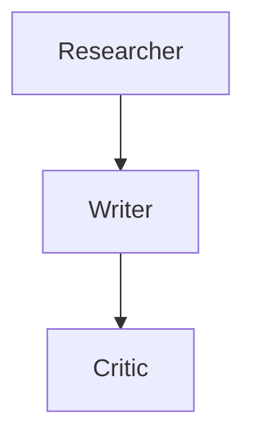
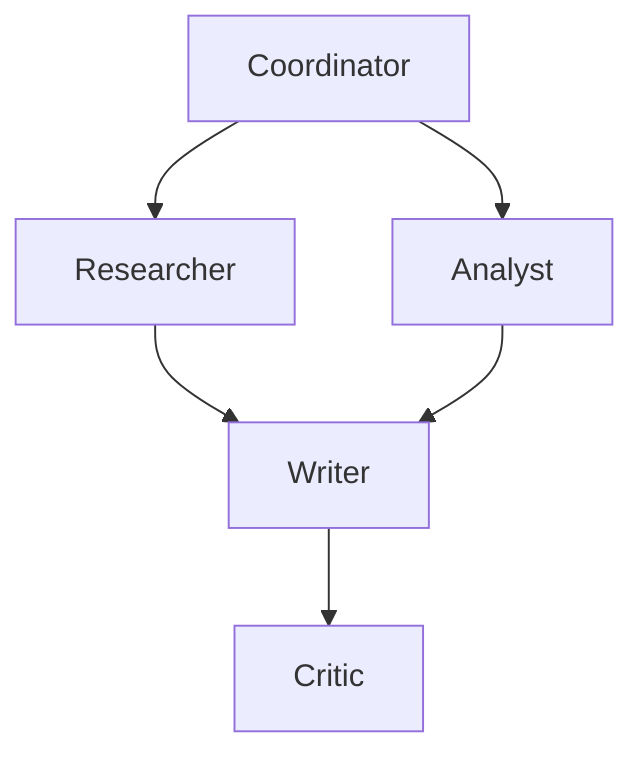
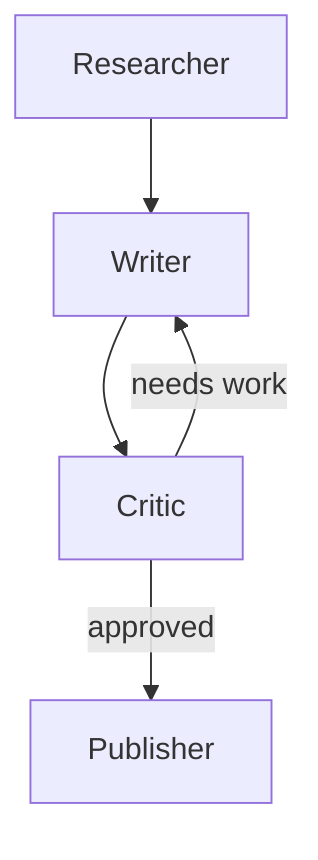
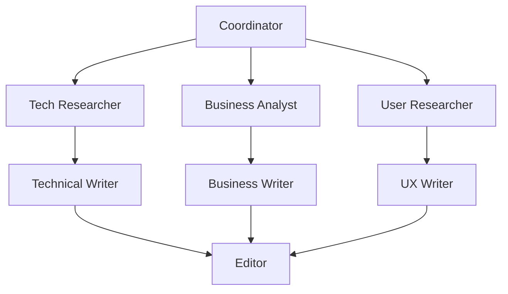

# Architecture Comparison Guide

Compare different multi-agent architectures for the same task.

## Scenario: Blog Post Creation

**Task**: Research a topic and write a comprehensive blog post.

## Architecture 1: Sequential Pipeline



**Agents**: 3  
**Connections**: 2  
**Execution**: Sequential

### Configuration

```python
# Researcher
- Role: RESEARCHER
- Tools: web_search
- Memory: short_term (10)

# Writer
- Role: WRITER
- Tools: none
- Memory: short_term (5)

# Critic
- Role: CRITIC
- Tools: none
- Memory: shared
```

### Pros
- ✅ Simple and predictable
- ✅ Easy to debug
- ✅ Clear data flow
- ✅ Low complexity

### Cons
- ❌ Slower (sequential execution)
- ❌ No parallel processing
- ❌ Single perspective

### Best For
- Simple workflows
- Learning/prototyping
- Predictable tasks

---

## Architecture 2: Parallel Analysis



**Agents**: 5  
**Connections**: 5  
**Execution**: Mixed (parallel + sequential)

### Configuration

```python
# Coordinator
- Role: COORDINATOR
- Tools: none
- Memory: shared

# Researcher + Analyst (parallel)
- Role: RESEARCHER / ANALYST
- Tools: web_search, calculator
- Memory: short_term (10)

# Writer
- Role: WRITER
- Tools: none
- Memory: shared (access all research)

# Critic
- Role: CRITIC
- Tools: none
- Memory: shared
```

### Pros
- ✅ Faster (parallel research)
- ✅ Multiple perspectives
- ✅ Richer analysis
- ✅ Better quality

### Cons
- ❌ More complex
- ❌ Harder to debug
- ❌ Higher cost (more API calls)

### Best For
- Complex analysis
- Multiple data sources
- Time-sensitive tasks

---

## Architecture 3: Iterative Refinement



**Agents**: 4  
**Connections**: 4 (with conditional loop)  
**Execution**: Iterative

### Configuration

```python
# Researcher
- Role: RESEARCHER
- Tools: web_search
- Memory: long_term (persistent)

# Writer
- Role: WRITER
- Tools: none
- Memory: short_term (5)

# Critic
- Role: CRITIC
- Tools: none
- Memory: shared
- Condition: "approved" → Publisher, else → Writer

# Publisher
- Role: EXECUTOR
- Tools: file_writer, api_caller
- Memory: none
```

### Pros
- ✅ Highest quality output
- ✅ Self-correcting
- ✅ Adaptive refinement
- ✅ Quality gates

### Cons
- ❌ Unpredictable execution time
- ❌ Potential infinite loops
- ❌ Highest cost
- ❌ Complex debugging

### Best For
- Quality-critical content
- Iterative improvement
- High-stakes outputs

---

## Architecture 4: Specialist Team



**Agents**: 8  
**Connections**: 9  
**Execution**: Highly parallel

### Configuration

```python
# Coordinator
- Role: COORDINATOR
- Tools: none
- Memory: shared

# Specialists (3 parallel tracks)
- Tech: Researcher → Writer
- Business: Analyst → Writer
- User: Researcher → Writer

# Editor (convergence)
- Role: CRITIC
- Tools: none
- Memory: shared (all perspectives)
```

### Pros
- ✅ Domain expertise
- ✅ Comprehensive coverage
- ✅ Multiple viewpoints
- ✅ Specialized outputs

### Cons
- ❌ Most complex
- ❌ Highest cost
- ❌ Coordination overhead
- ❌ Difficult to debug

### Best For
- Enterprise content
- Multi-stakeholder needs
- Comprehensive analysis

---

## Performance Comparison

| Architecture | Agents | Time | Cost | Quality | Complexity |
|--------------|--------|------|------|---------|------------|
| Sequential   | 3      | 6s   | $    | ⭐⭐⭐   | Low        |
| Parallel     | 5      | 4s   | $$   | ⭐⭐⭐⭐  | Medium     |
| Iterative    | 4      | 8-12s| $$$  | ⭐⭐⭐⭐⭐ | High       |
| Specialist   | 8      | 5s   | $$$$ | ⭐⭐⭐⭐⭐ | Very High  |

## Use Case Mapping

### Quick Blog Post
→ **Sequential Pipeline**
- Fast setup
- Good enough quality
- Low cost

### Research Article
→ **Parallel Analysis**
- Multiple sources
- Balanced speed/quality
- Moderate cost

### White Paper
→ **Iterative Refinement**
- Highest quality
- Worth the time
- Quality over speed

### Enterprise Report
→ **Specialist Team**
- Multiple stakeholders
- Comprehensive coverage
- Budget available

---

## Comparison Methodology

### 1. Define Scenario
```python
scenario = {
    "task": "Write blog post about AI agents",
    "input": "Research and write 800 words",
    "success_criteria": [
        "Accurate information",
        "Engaging writing",
        "Well-structured"
    ]
}
```

### 2. Build Architectures
Create each architecture in the visual builder or programmatically.

### 3. Execute Same Input
```python
results_seq = await engine.execute_workflow(sequential_wf, scenario["input"])
results_par = await engine.execute_workflow(parallel_wf, scenario["input"])
results_iter = await engine.execute_workflow(iterative_wf, scenario["input"])
results_spec = await engine.execute_workflow(specialist_wf, scenario["input"])
```

### 4. Compare Metrics

```python
def compare_results(results_list):
    return {
        "total_time": sum(r.execution_time for r in results_list),
        "agents_used": len(results_list),
        "tools_used": sum(len(r.tools_used) for r in results_list),
        "memory_accesses": sum(1 for r in results_list if r.memory_accessed),
        "errors": sum(1 for r in results_list if r.error)
    }
```

### 5. Evaluate Quality

Manual evaluation criteria:
- Accuracy (1-5)
- Completeness (1-5)
- Clarity (1-5)
- Engagement (1-5)

---

## Decision Tree

```
Start
  │
  ├─ Need it fast? ──→ Sequential
  │
  ├─ Need multiple perspectives? ──→ Parallel
  │
  ├─ Need highest quality? ──→ Iterative
  │
  └─ Need comprehensive coverage? ──→ Specialist
```

## Optimization Tips

### Sequential Pipeline
- Optimize prompts for each agent
- Use appropriate memory sizes
- Add tools only where needed

### Parallel Analysis
- Balance parallel branches
- Use shared memory for synthesis
- Coordinate with clear roles

### Iterative Refinement
- Set max iterations (prevent loops)
- Clear success criteria
- Strong critic prompts

### Specialist Team
- Clear role definitions
- Avoid overlap
- Strong coordinator
- Efficient synthesis

---

## Real-World Examples

### Sequential: Daily Newsletter
```
Researcher → Writer → Critic
Time: 5s | Cost: $ | Quality: Good
```

### Parallel: Market Analysis
```
Coordinator → [Tech Analyst, Market Analyst, Competitor Analyst] → Writer → Critic
Time: 6s | Cost: $$ | Quality: Excellent
```

### Iterative: Legal Document
```
Researcher → Writer → Legal Reviewer → (loop) → Approver
Time: 15s | Cost: $$$ | Quality: Exceptional
```

### Specialist: Product Launch
```
Coordinator → [Tech, Marketing, Sales, Support] → Writers → Editor → Approver
Time: 8s | Cost: $$$$ | Quality: Comprehensive
```

---

## Experimentation Framework

### Test Matrix

| Architecture | Input Type | Expected Output | Actual Output | Score |
|--------------|------------|-----------------|---------------|-------|
| Sequential   | Simple     | 500 words       | 487 words     | 4/5   |
| Parallel     | Complex    | 1000 words      | 1023 words    | 5/5   |
| Iterative    | Critical   | Perfect         | 2 iterations  | 5/5   |
| Specialist   | Multi-facet| Comprehensive   | 8 sections    | 5/5   |

### A/B Testing

```python
# Run same input through different architectures
results = {
    "sequential": await test_architecture(sequential_wf, test_input),
    "parallel": await test_architecture(parallel_wf, test_input),
    "iterative": await test_architecture(iterative_wf, test_input),
    "specialist": await test_architecture(specialist_wf, test_input)
}

# Compare
best = max(results.items(), key=lambda x: x[1]["quality_score"])
print(f"Best architecture: {best[0]}")
```

---

## Conclusion

**No single architecture is best for everything.**

Choose based on:
- Task complexity
- Time constraints
- Budget
- Quality requirements
- Team expertise

Start simple (Sequential), then evolve as needs grow.

---

## Export Your Comparison

```python
# Save all architectures
builder.save_workflow(sequential_wf.id, "sequential.json")
builder.save_workflow(parallel_wf.id, "parallel.json")
builder.save_workflow(iterative_wf.id, "iterative.json")
builder.save_workflow(specialist_wf.id, "specialist.json")

# Export diagrams
for wf in [sequential_wf, parallel_wf, iterative_wf, specialist_wf]:
    diagram = builder.export_visualization(wf.id)
    print(f"\n{wf.name}:\n{diagram}")
```

Share your findings with the community!
