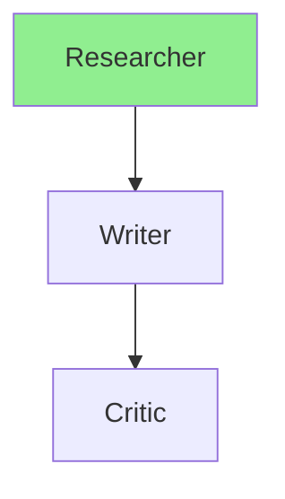

# Visual Interface Guide

## Interface Overview

```
┌─────────────────────────────────────────────────────────────────┐
│  🎭 Multi-Agent Workflow Playground                             │
│  Build, visualize, and execute multi-agent systems              │
└─────────────────────────────────────────────────────────────────┘

┌──────────────┬──────────────────────────────────────────────────┐
│              │                                                  │
│  SIDEBAR     │              CANVAS                              │
│              │                                                  │
│ Agent        │    ┌──────────────┐                             │
│ Palette:     │    │ 🔍 Researcher│                             │
│              │    │  researcher  │                             │
│ 🔍 Researcher│    │ 1 tools      │                             │
│ ✍️ Writer    │    └──────┬───────┘                             │
│ 🎯 Critic    │           │                                      │
│ 🎪 Coordinator│          ↓                                      │
│ 📊 Analyst   │    ┌──────────────┐                             │
│ ⚡ Executor   │    │ ✍️ Writer    │                             │
│              │    │  writer      │                             │
│ ─────────────│    │ 0 tools      │                             │
│              │    └──────┬───────┘                             │
│ ▶️ Run       │           │                                      │
│ 💾 Save      │           ↓                                      │
│ 📂 Load      │    ┌──────────────┐                             │
│ 📤 Export    │    │ 🎯 Critic    │                             │
│ 🗑️ Clear     │    │  critic      │                             │
│              │    │ 0 tools      │                             │
│              │    └──────────────┘                             │
│              │                                                  │
└──────────────┴──────────────────────────────────────────────────┘
                                                                   
┌─────────────────────────────────────────────────────────────────┐
│  EXECUTION RESULTS                                              │
│                                                                 │
│  1. Researcher                                                  │
│     Input: Research the benefits...                             │
│     Output: Found 5 key insights about multi-agent systems...   │
│     Tools: web_search | Memory: ✓ | Time: 2.3s                 │
│                                                                 │
│  2. Writer                                                      │
│     Input: Found 5 key insights...                              │
│     Output: Multi-agent systems offer several advantages...     │
│     Tools: None | Memory: ✓ | Time: 1.8s                       │
│                                                                 │
│  3. Critic                                                      │
│     Input: Multi-agent systems offer...                         │
│     Output: The content is well-structured. Suggestions...      │
│     Tools: None | Memory: ✓ | Time: 1.5s                       │
└─────────────────────────────────────────────────────────────────┘
```

## Interaction Flow

### 1. Building a Workflow

```
Step 1: Drag Agent
┌──────────────┐
│ 🔍 Researcher│  ──drag──>  Canvas
└──────────────┘

Step 2: Configure Agent (double-click)
┌─────────────────────────────┐
│ Configure Agent             │
│                             │
│ Name: [Research Specialist] │
│                             │
│ Prompt: [You are a...]      │
│                             │
│ Tools:                      │
│  [✓] 🔍 Web Search          │
│  [ ] 🔢 Calculator          │
│  [ ] 📄 File Reader         │
│                             │
│ Memory: [Short-term ▼]      │
│                             │
│ [Save] [Cancel]             │
└─────────────────────────────┘

Step 3: Connect Agents (click first, then second)
┌──────────────┐
│ 🔍 Researcher│ ← Click 1
└──────┬───────┘
       │ (connection created)
       ↓
┌──────────────┐
│ ✍️ Writer    │ ← Click 2
└──────────────┘
```

### 2. Running a Workflow

```
Click "▶️ Run Workflow"
       ↓
┌─────────────────────────────┐
│ Enter initial input:        │
│                             │
│ [Research AI agents and     │
│  write a summary]           │
│                             │
│ [Run] [Cancel]              │
└─────────────────────────────┘
       ↓
Execution starts...
       ↓
Results appear in bottom panel
```

### 3. Inspecting Results

```
Each execution step shows:

┌─────────────────────────────────────────┐
│ 1. Research Specialist                  │
│ ─────────────────────────────────────── │
│ Input: Research AI agents and write...  │
│ Output: AI agents are autonomous...     │
│ Tools: web_search                       │
│ Memory: ✓                               │
│ Time: 2.3s                              │
└─────────────────────────────────────────┘
```

## Agent States

### Entry Point (First Agent)
```
┌──────────────┐
│ 🔍 Researcher│  ← Green border
│  researcher  │     (entry point)
│ 1 tools      │
└──────────────┘
```

### Regular Agent
```
┌──────────────┐
│ ✍️ Writer    │  ← Purple border
│  writer      │     (regular)
│ 0 tools      │
└──────────────┘
```

### Connecting Mode
```
┌──────────────┐
│ 🔍 Researcher│  ← Green border
│  researcher  │     (selected for connection)
│ 1 tools      │
└──────────────┘
```

## Workflow Patterns

### Sequential
```
A → B → C → D
```

### Branching (Conditional)
```
    ┌─→ B
A ──┤
    └─→ C
```

### Convergent
```
A ──┐
    ├─→ C
B ──┘
```

### Cyclic (with conditions)
```
A → B → C
    ↑   │
    └───┘
```

## Export Formats

### JSON Export
```json
{
  "agents": [
    {
      "id": "agent_123",
      "name": "Researcher",
      "role": "researcher",
      "tools": ["web_search"],
      "memory": "short_term"
    }
  ],
  "connections": [
    {
      "from": "agent_123",
      "to": "agent_456"
    }
  ]
}
```

### Mermaid Export


## Keyboard Shortcuts

| Key | Action |
|-----|--------|
| Double-click agent | Configure agent |
| Click agent (2x) | Create connection |
| Drag agent | Move on canvas |
| Click × button | Delete agent |

## Color Coding

| Color | Meaning |
|-------|---------|
| 🟢 Green | Entry point agent |
| 🟣 Purple | Regular agent |
| 🔴 Red | Error in execution |
| 🟡 Yellow | Warning/info |

## Execution States

```
🚀 Starting...
   ↓
⚙️ Executing Agent 1...
   ↓
⚙️ Executing Agent 2...
   ↓
⚙️ Executing Agent 3...
   ↓
✅ Completed!
```

## Error Handling

```
If error occurs:

┌─────────────────────────────────────────┐
│ 1. Research Specialist                  │
│ ─────────────────────────────────────── │
│ Input: Research AI agents...            │
│ Output: (empty)                         │
│ Tools: web_search                       │
│ Memory: ✓                               │
│ Time: 0.5s                              │
│ ❌ Error: API key not configured        │
└─────────────────────────────────────────┘

Execution stops at error point.
```

## Tips

1. **Start simple** - Begin with 2-3 agents
2. **Test incrementally** - Add one agent at a time
3. **Use memory wisely** - Short-term for context, shared for collaboration
4. **Name descriptively** - Clear names help debugging
5. **Export often** - Save your workflows as you build

## Mobile View

The interface is responsive but works best on desktop for drag-and-drop functionality.

## Browser Compatibility

- ✅ Chrome/Edge (recommended)
- ✅ Firefox
- ✅ Safari
- ⚠️ Mobile browsers (limited drag-and-drop)
