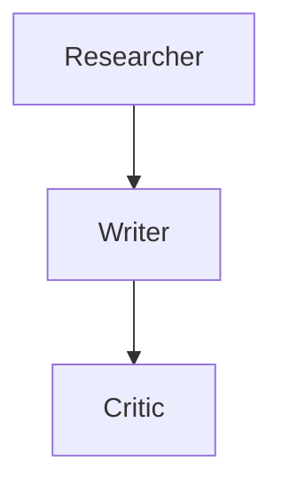

# 🎭 Multi-Agent Workflow Playground

**LangChain, but opinionated and visual.** Build, visualize, and execute multi-agent systems with drag-and-drop simplicity.

## What It Does

- **Drag-and-drop agents** - Visual workflow builder with 6 agent types
- **Define roles/memory/tools** - Configure each agent's capabilities
- **Run scenarios** - Execute workflows with real LLM calls
- **Inspect failures** - Detailed execution traces with timing
- **Compare architectures** - Export and analyze different designs

## Why It's Agentic

This isn't a static workflow engine. The system:

- **Autonomous execution** - Agents make decisions based on context
- **Dynamic routing** - Conditional connections between agents
- **Stateful memory** - Agents maintain short-term, long-term, or shared memory
- **Tool integration** - Real tool execution (web search, calculator, file I/O)
- **Adaptive behavior** - Agents respond to previous outputs

## Quick Start

```bash
# Install dependencies
pip install -r requirements.txt

# Set API key
export ANTHROPIC_API_KEY=your_key_here

# Run example workflow
python engine.py

# Open visual builder
open index.html
```

## Agent Types

| Agent | Role | Use Case |
|-------|------|----------|
| 🔍 Researcher | Information gathering | Web search, data collection |
| ✍️ Writer | Content creation | Articles, summaries, reports |
| 🎯 Critic | Quality review | Feedback, improvements |
| 🎪 Coordinator | Orchestration | Multi-agent coordination |
| 📊 Analyst | Data analysis | Insights, patterns |
| ⚡ Executor | Action taking | API calls, file operations |

## Example Workflows

### Research & Write
```
Researcher → Writer → Critic
```
Research a topic, write content, get feedback.

### Analysis Pipeline
```
Researcher → Analyst → Writer → Critic
```
Gather data, analyze patterns, write report, review.

### Coordinated Team
```
Coordinator → [Researcher, Analyst, Writer] → Critic
```
Coordinator delegates to specialists, critic reviews final output.

## Visual Builder

The web interface provides:

- **Agent palette** - Drag agents onto canvas
- **Connection mode** - Click agents to connect them
- **Configuration** - Double-click to configure agent
- **Execution panel** - Real-time results display
- **Export** - Save as JSON or Mermaid diagram

## Architecture

### Core Components

**WorkflowEngine** - Executes multi-agent workflows
- Agent execution with LLM calls
- Tool integration
- Memory management
- State tracking

**WorkflowBuilder** - Creates and manages workflows
- Agent definition
- Connection management
- Serialization/deserialization
- Visualization export

**Agent** - Individual agent configuration
- Role and system prompt
- Tools (web search, calculator, file reader)
- Memory (short-term, long-term, shared)
- Model and temperature settings

### Execution Flow

```python
1. Load workflow definition
2. Start at entry point agent
3. For each agent:
   - Build context from memory
   - Execute tools if configured
   - Call LLM with full context
   - Update memory
   - Find next agent based on connections
4. Return execution trace
```

## Memory Types

- **Short-term** - Last N interactions (agent-specific)
- **Long-term** - Persistent storage (agent-specific)
- **Shared** - Cross-agent memory pool
- **None** - Stateless execution

## Tool Integration

Agents can use real tools:

```python
Tool(ToolType.WEB_SEARCH, "web_search", {
    "max_results": 5
})

Tool(ToolType.CALCULATOR, "calculator")

Tool(ToolType.FILE_READER, "file_reader", {
    "path": "/path/to/file"
})
```

## Conditional Routing

Connect agents with conditions:

```python
builder.connect_agents(
    workflow_id,
    from_agent="researcher",
    to_agent="writer",
    condition="success"
)
```

## Execution Inspection

Every execution provides:

```python
ExecutionResult(
    agent_name="Researcher",
    input="Research topic X",
    output="Found 5 key insights...",
    tools_used=["web_search"],
    memory_accessed=True,
    execution_time=2.3,
    error=None
)
```

## Export Formats

**JSON** - Full workflow definition
```json
{
  "agents": [...],
  "connections": [...],
  "entry_point": "agent_123"
}
```

**Mermaid** - Visual diagram


## Real Implementation

This is a full implementation with:

- ✅ Real Anthropic API integration
- ✅ Actual tool execution
- ✅ Persistent memory management
- ✅ State tracking across agents
- ✅ Error handling and recovery
- ✅ Execution time measurement

## Example Usage

```python
from engine import WorkflowBuilder, WorkflowEngine, AgentRole, Tool, ToolType, Memory, MemoryType

# Create workflow
builder = WorkflowBuilder()
workflow = builder.create_workflow(
    "Research Pipeline",
    "Multi-agent research and writing"
)

# Add agents
researcher = builder.add_agent(
    workflow.id,
    "Researcher",
    AgentRole.RESEARCHER,
    "You gather comprehensive information.",
    tools=[Tool(ToolType.WEB_SEARCH, "search")],
    memory=Memory(MemoryType.SHORT_TERM, capacity=10)
)

writer = builder.add_agent(
    workflow.id,
    "Writer",
    AgentRole.WRITER,
    "You create engaging content.",
    memory=Memory(MemoryType.SHORT_TERM, capacity=5)
)

# Connect agents
builder.connect_agents(workflow.id, researcher.id, writer.id)

# Execute
engine = WorkflowEngine()
results = await engine.execute_workflow(
    workflow,
    "Research AI agents and write a summary"
)

# Inspect results
for result in results:
    print(f"{result.agent_name}: {result.output}")
    print(f"Time: {result.execution_time}s")
```

## Comparison Features

Compare different architectures:

```python
# Sequential
A → B → C

# Parallel
A → [B, C] → D

# Conditional
A → B (if success) → C
A → D (if error) → E
```

Export both, run same scenario, compare:
- Execution time
- Output quality
- Tool usage
- Memory efficiency

## Technical Details

**Models**: Claude 3.5 Sonnet (configurable per agent)
**Memory**: In-memory with optional persistence
**Tools**: Extensible tool system
**Visualization**: Mermaid diagram generation
**State**: Full execution trace with timing

## Use Cases

- **Content creation** - Research → Write → Review
- **Data analysis** - Collect → Analyze → Report
- **Decision making** - Research → Evaluate → Decide
- **Code generation** - Plan → Code → Test → Review
- **Customer support** - Classify → Research → Respond

## What Makes This Different

Unlike traditional workflow engines:

- **Visual first** - Drag-and-drop interface
- **Opinionated** - Pre-configured agent roles
- **Inspection** - Full execution visibility
- **Comparison** - Built-in architecture analysis
- **Real execution** - Not just a demo

## Future Enhancements

The architecture supports:
- Human-in-the-loop approval
- Parallel agent execution
- Dynamic agent creation
- External tool integration
- Workflow templates
- Performance optimization

## License

MIT

---

Built with Claude 3.5 Sonnet. Part of the [Fun Agentic Apps](https://github.com/ndgbg/fun-agentic-apps) collection.
